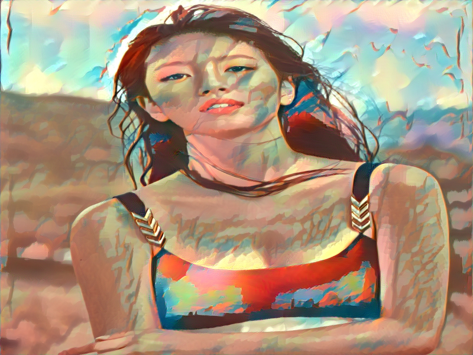
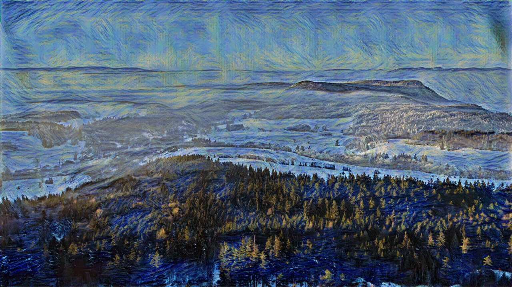
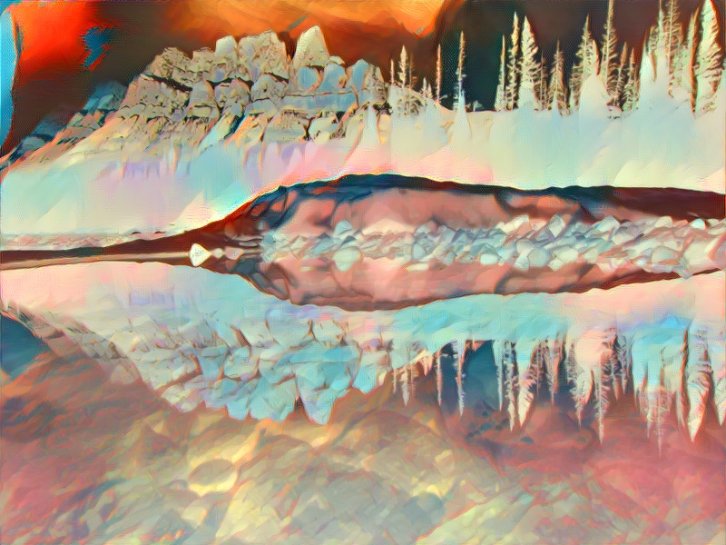
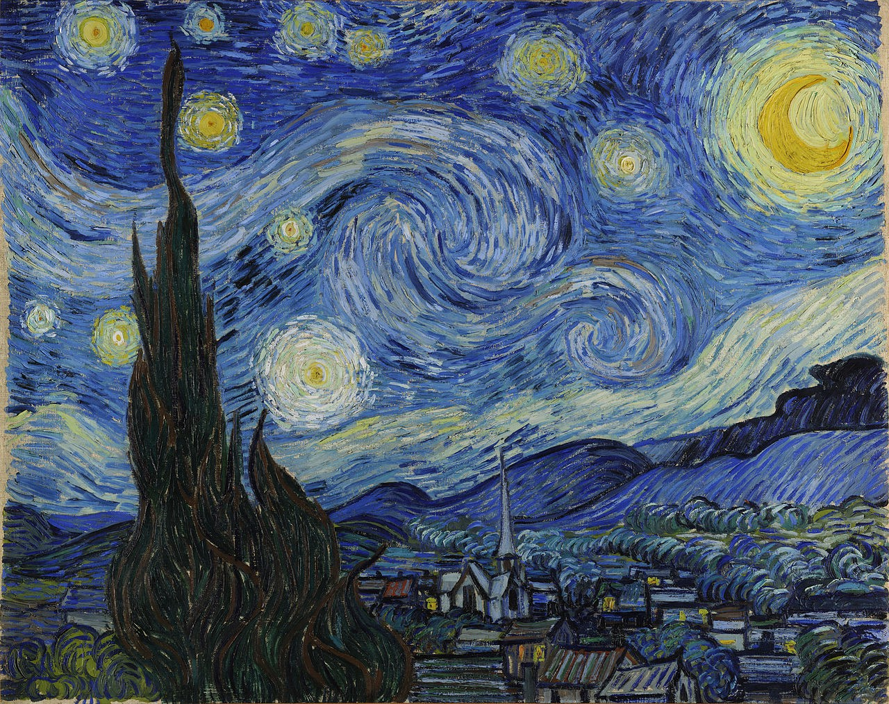
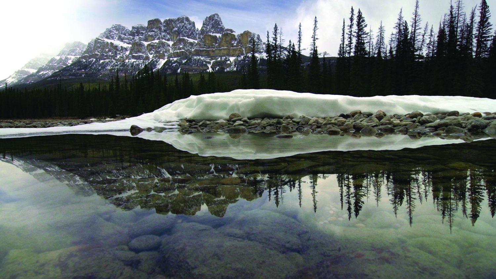
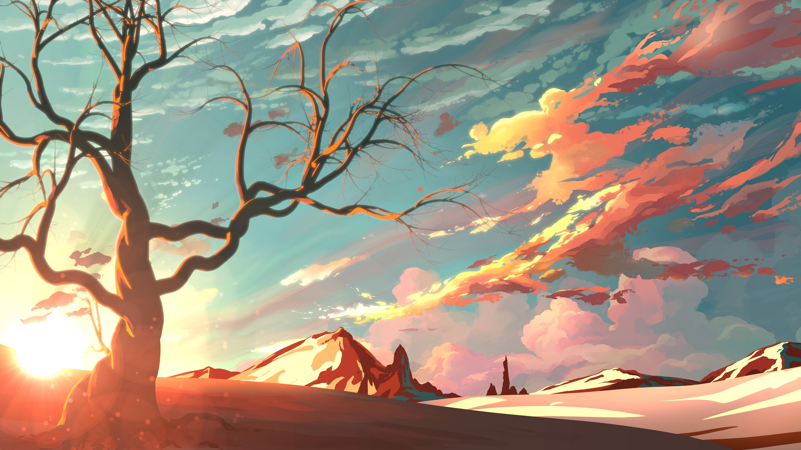

#### Gatys' Style Transfer and Universal Feature Transform

_This is a personal mini-project. I tried to reimplement the Style Transfer methods described in the
Gatys' [paper](https://arxiv.org/pdf/1508.06576.pdf) and Adobe's [paper](https://arxiv.org/pdf/1705.08086.pdf).
The code is written with Pytorch_

##### Image Preprocessing phase for VGG Nets
Typically for the pretrained `vgg19` (without `batch_normalization`) model of Pytorch, before passing to
the network, the image should be:
* rescaled (to size minimum `224x224`)
* transformed from `BGR` to `RGB`
* normalized with `mean=[0.40760392, 0.45795686, 0.48501961]` and `std=[1, 1, 1]`
* the matrix should then be upscaled by a factor `255.0`

The _postprocess_ should be a complete inverse of the preprocess above.

##### Original Gatys' method

You can try the following command:
```bash
python extract.py -c <content-img-fn> -s <style-img-fn> --size <height> <width> --lambd 0.5
```

All images should be located in `./images/` and with format `.jpg`

For example, you can try the following command

```bash
python extract.py -c girl -s stl --size 600 800 --lambd 0.5
```

, expectedly it will produce




Here are some results:





compared to original pictures:






